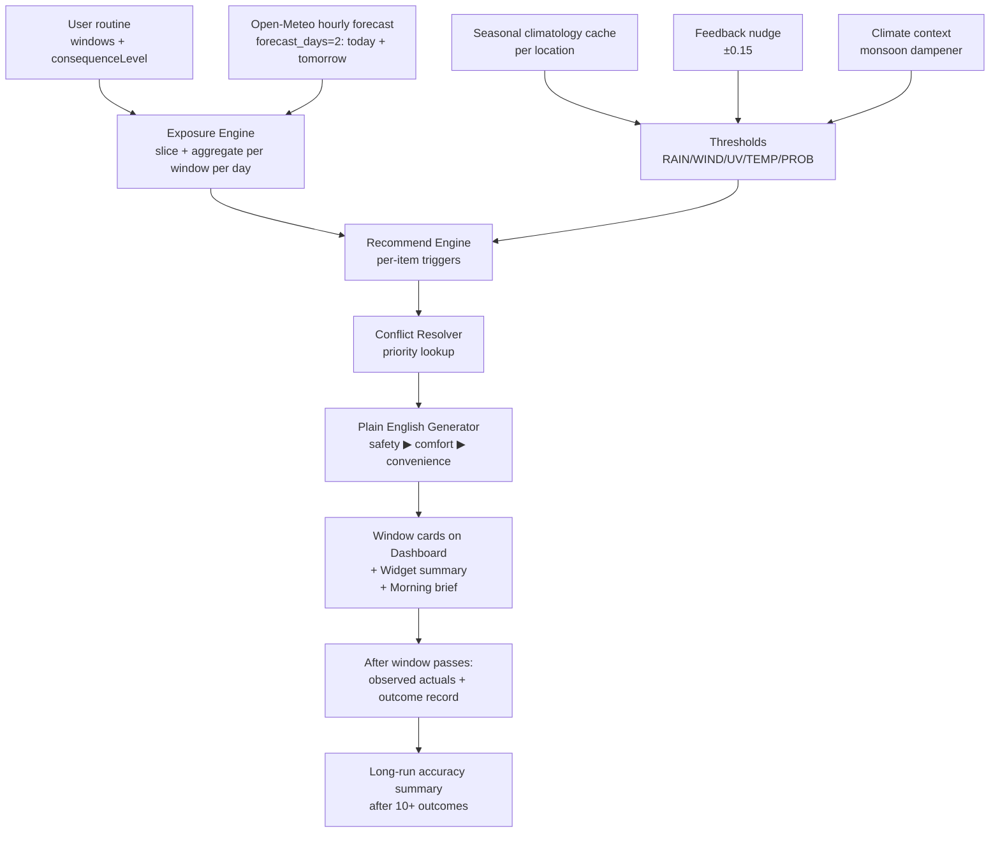
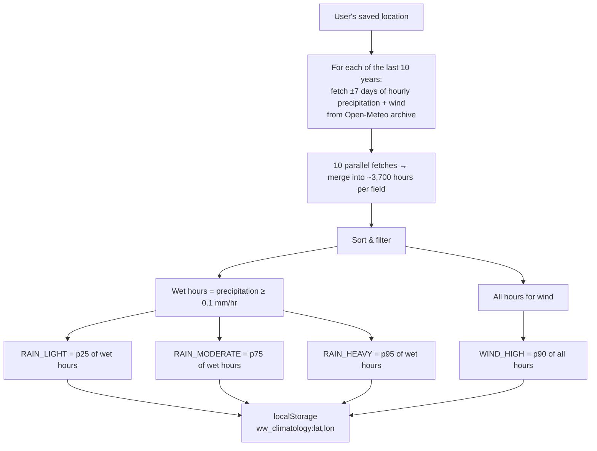
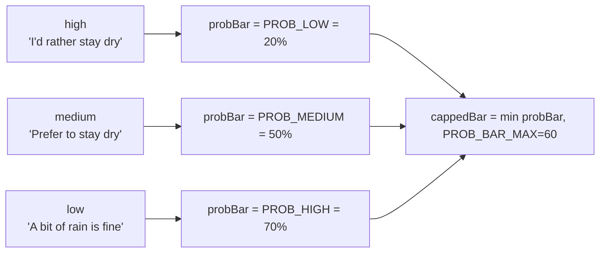
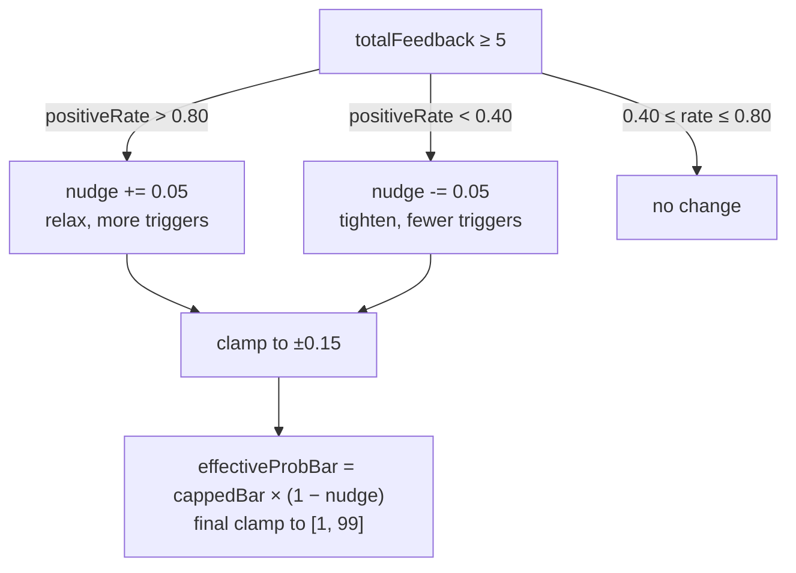
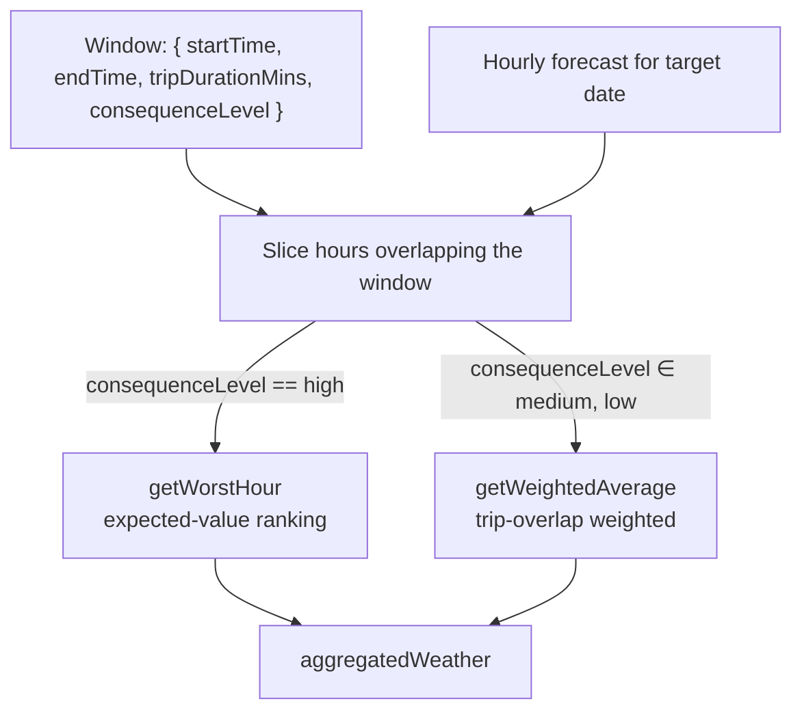
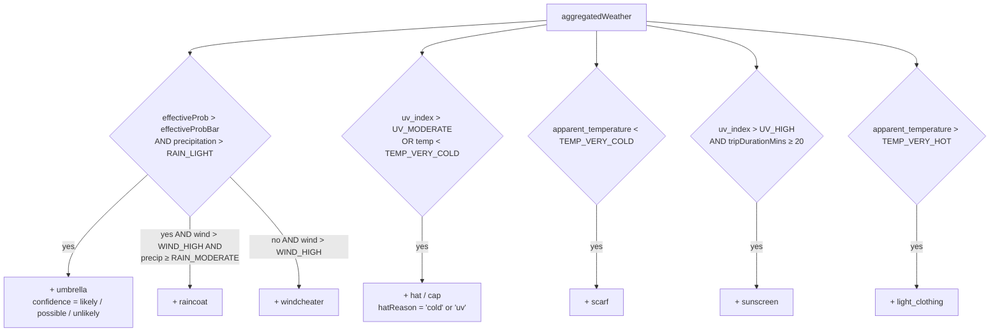
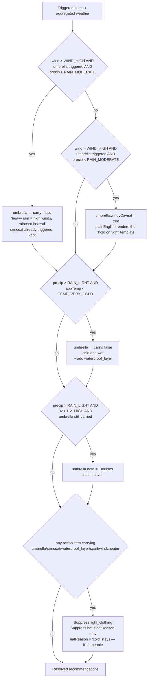

# WeatherWise Algorithm — Flow Reference

A precise map of every threshold, every trigger, and every conflict rule that turns hourly weather into your recommendations. Use this as the source of truth when refining the algorithm.

Where this differs from the original brief in `ALGORITHM.md`, the code reflects the version below. This doc is regenerated each time the algorithm changes.

---

## 1. End-to-end pipeline



The same pipeline runs once per routine window per day. The dashboard exposes today and tomorrow via a date toggle; widget and morning brief always use today only.

---

## 2. Where every threshold comes from

`src/core/thresholds.js` holds the threshold table. Some are absolute (human physiology), some are climatology-derived (regional norms), one is per-user (consequence level), and one shifts over time (feedback nudge).

### 2a. Static thresholds — absolute

These never change. They map to human physiology and the WHO UV scale, not local climate.

| Threshold | Value | Used by |
|---|---|---|
| `UV_MODERATE` | `5` | hat trigger (UV path) |
| `UV_HIGH` | `7` | sunscreen trigger, umbrella sun-cover annotation |
| `TEMP_VERY_COLD` | `8 °C` | scarf, hat (cold path), waterproof_layer (cold+rain) |
| `TEMP_COLD` | `16 °C` | (band boundary, not a direct trigger) |
| `TEMP_HOT` | `30 °C` | (band boundary — no longer a direct trigger after SESSION_FIX_2-A+B) |
| `TEMP_VERY_HOT` | `37 °C` | **light_clothing trigger** |
| `TEMP_BURN` | `42 °C` | reserved for future burn-risk warning |
| `PROB_LOW` | `20 %` | "I'd rather stay dry" trigger bar (consequenceLevel: high) |
| `PROB_MEDIUM` | `50 %` | "I prefer to stay dry, but I'll manage" bar (medium) |
| `PROB_HIGH` | `70 %` | "A bit of rain is fine" bar (low) |
| `PROB_BAR_MAX` | `60 %` | hard ceiling on the effective bar after multipliers |
| `WORST_HOUR_PROB_FLOOR` | `30 %` | minimum probability to be eligible as the "worst hour" |

### 2b. Climatology-derived thresholds — `RAIN_*` and `WIND_HIGH`

Calibrated to *what's normal for this location at this time of year*. Cached for 7 days; refreshed in the background.



**Why ±7 days × 10 years:** tight seasonal window — calibrates to *this week of this season*, not the whole month. Tighter than the original ±15-day window because seasonal sub-periods (e.g. early vs late monsoon onset) have distinct distributions worth keeping separate.

**Why p25/p75/p95 over *wet* hours:** if we included dry hours (most of the year is 0 mm/hr), every rain percentile collapses to zero and `precipitation > RAIN_LIGHT` always fires. Wet-hour percentiles describe "how heavy is the rain when it rains."

**Why p90 wind, not p60:** the original spec used p60, but p60 = "the typical 40th percent windiest hour" which by definition is normal. p90 = "windier than 90% of normal hours" — actually disruptive.

**Defaults when cache is missing:** `RAIN_LIGHT 0.5`, `RAIN_MODERATE 2`, `RAIN_HEAVY 8`, `WIND_HIGH 30` (km/h). Used until first background fetch completes.

### 2c. Consequence level → probability bar (per window)

Each window stores a `consequenceLevel` of `'high' | 'medium' | 'low'`, framed by how bad getting wet would be (not abstract "risk tolerance"). This selects which probability threshold triggers rain recommendations.



**The `PROB_BAR_MAX = 60` cap** prevents the monsoon multiplier (§2e) from making rain triggers mathematically unreachable for low-tolerance users in monsoon regions. Without it, a relaxed user (probBar=70) × 0.7 multiplier would need `rawProb > 100%`, impossible. Side effect: this also lowers the relaxed bar to 60% in non-monsoon contexts — defensible since 70% is "very likely" anyway.

### 2d. Feedback nudge — moves the probability bar over time

After 5+ feedback responses (yes felt right / not quite), the engine adjusts the bar to match the user's actual hit rate.



Nudge is applied **only** to `PROB_*` thresholds. `RAIN_*`, `WIND_HIGH`, `UV_*`, `TEMP_*` are never moved by feedback.

### 2e. Climate context — monsoon dampener

```
effectiveProb = rawProb × sensitivityMultiplier
```

| Region | Months | sensitivityMultiplier |
|---|---|---|
| Tropical / Monsoon (lat 0–25, N hemisphere) | Jun–Sep | 0.7 |
| Tropical / Monsoon (lat 0–25, S hemisphere) | Dec–Mar | 0.7 |
| Everything else | always | 1.0 |

A 60% rain forecast in Mumbai in July is treated as 42%, raising the bar so we don't shout "umbrella!" every day of the rainy season.

> **Note:** `sensitivityMultiplier` may be redundant with climatology calibration (the seasonal `RAIN_*` percentiles already encode "what counts as notable rain here"). A `TODO` in `recommendEngine.js` flags this for future review.

---

## 3. Per-window pipeline (Exposure Engine)

For each window in the routine, after deviation overrides:



**Worst hour (high-consequence users):** ranks hours by *expected precipitation* = `precip × prob/100`. An 8 mm/hr forecast at 15% probability has expected 1.2; a 2 mm/hr forecast at 75% has expected 1.5 → the 75%-probability hour wins. Hours with `prob < WORST_HOUR_PROB_FLOOR (30%)` are filtered before ranking; full pool falls through on dry-day windows. Ties broken by wind speed so dry-but-windy windows still surface the gust hour.

**Weighted average (medium/low consequence):** each hour weighted by the number of trip-minutes that actually fall inside it. A 20-min trip centred in a 2-hr window equally weights both hours; an off-centre trip biases the closer hour. Falls back to equal weights if `tripDurationMins` is missing.

---

## 4. Recommendation Engine — per-item triggers

The engine reads `aggregatedWeather` + the threshold table and emits an item per matching rule. Multiple can fire for one window.



**Raincoat only fires for heavy rain + high wind** — moderate or lighter rain in high winds is handled by Rule 1b of the conflict resolver (umbrella stays with a "breezy" caveat).

**`light_clothing` requires `TEMP_VERY_HOT (37°C)`**, not `TEMP_HOT`. Tropical-climate "warm" is normal weather, not actionable; 37°C+ apparent is when the recommendation is actually useful.

**Hat records its trigger reason** (`hatReason: 'cold' | 'uv'`) so the conflict resolver can later suppress UV-driven hats when an action item already covers sun.

### Confidence labels (umbrella only)

| Rule | Result |
|---|---|
| `prob > 60% AND precip ≥ RAIN_MODERATE` | **likely** |
| `30% ≤ prob ≤ 60%` | **possible** |
| `prob < 30%` | **unlikely** |
| else | possible |

Other items always emit `confidence: 'likely'` — temp/wind/UV are observations, not chances.

---

## 5. Conflict Resolver

Conflicts apply *after* triggers, in priority order. Suppressed items stay in the output with `carry: false` and a reason so the UI can explain itself.



- **Rule 1a** — heavy rain + high wind: suppress umbrella, raincoat carries.
- **Rule 1b** — light rain + high wind: keep umbrella, set `windyCaveat`. plainEnglish renders "Carry an umbrella, but it's breezy — hold on tight." No raincoat in this branch.
- **Rule 2** — cold + rain: replace umbrella with `waterproof_layer`.
- **Rule 3** — UV + rain: annotate umbrella as "doubles as sun cover."
- **Rule 4** — any action item carrying: drop redundant informational items (`light_clothing`, UV-driven `hat`). Cold-driven `hat` stays since it's a real carry item.

---

## 6. Plain English output

Active recommendations (`carry: true`) sorted by priority, capped at 3 sentences per window. Probability figures are embedded inline so the number becomes ambient over time — users absorb that recommendations are anchored to probabilities, not certainties.

**Priority order:**

```
raincoat ▶ waterproof_layer ▶ umbrella ▶ scarf ▶ windcheater ▶ sunscreen ▶ hat ▶ light_clothing
```

**Template selection (excerpts from `src/core/plainEnglish.js`):**

| Item + confidence | Sentence |
|---|---|
| raincoat | "Heavy rain with high winds during your {label} (90% chance) — an umbrella won't help. Take a raincoat." |
| waterproof_layer | "Cold and wet during your {label}. A waterproof layer is more useful than an umbrella." |
| umbrella + likely | "Rain is likely during your {label} (88% chance). Carry an umbrella." |
| umbrella + possible | "There's a 45% chance of rain on your {label}. Worth bringing an umbrella." |
| umbrella + unlikely | "Low chance of rain (22%). Probably fine without one." |
| umbrella + \*_windy | "…Carry an umbrella, but it's breezy — hold on tight." (light rain + high wind) |
| windcheater | "Strong winds during your {label}. A windcheater would help." |
| scarf | "It'll feel cold during your {label}. A scarf and warm layers advised." |
| hat | "Hat or cap recommended for your {label}." |
| sunscreen | "Apply sunscreen before your {label} — UV is high." |
| light_clothing | "Very hot during your {label}. Dress light, drink water." |
| all clear | "Looking clear for your {label} (8% chance of rain). Nothing extra needed." |

Tap the confidence chip on an umbrella card for the probability-range explanation behind the label (`likely` → 60%+, `possible` → 30–60%, `unlikely` → <30%, included only for high-consequence users).

---

## 7. Outcomes + accuracy summary

After a window has passed, `WindowCard` fires `ensureOutcome()` — idempotent, deduped via an in-flight promise map — which:

1. Records forecast values (probability + precipitation) at recommendation time.
2. Fetches observed actuals via Open-Meteo `/v1/forecast?past_days=2` (past hours come back as observation/analysis values).
3. Stores the record in `localStorage` under `ww_outcomes` (schema v1, capped at 200).

That record powers three UI elements:

- **Feedback prompt** — "Forecast: 65% rain · What happened: Light rain" comparison line above the "Yes, felt right / Not quite" buttons.
- **Outcome strip** — replaces the feedback prompt 6 hours after the window ends (or immediately after the user responds). Compact muted line for historical context.
- **Accuracy summary** — collapsible "About your forecasts" section at the bottom of the dashboard. Hidden until 10+ outcomes with observed data; before that it doesn't render at all. Buckets by forecast probability (≥60 = "likely", <30 = "unlikely") and shows raw rained-X%-of-time frequencies.

The feedback mapping into the nudge logic is unchanged: "Yes, felt right" = `wasHelpful: true`, "Not quite" = `false`.

---

## 8. Today / Tomorrow toggle

The dashboard pipeline runs against a `targetDate` (today or tomorrow). The same Open-Meteo fetch covers both days (`forecast_days: 2`), so switching tabs is instant after the first load.

| Behaviour | Today | Tomorrow |
|---|---|---|
| Pipeline `baseDate` | today | tomorrow |
| Apply deviations | yes | no — base routine only |
| Window status | past/active/upcoming | always upcoming |
| Outcome recording | yes | no (window hasn't happened) |
| Feedback prompt | yes for past windows | never |
| Floating "doing something different" button | yes | replaced with non-interactive "Deviations apply to today only." note |
| Accuracy summary | yes | hidden |

Widget and morning notification are always today-only. Tomorrow is a dashboard-only planning aid.

---

## 9. Where each input comes from

| Input | Source | Refresh cadence |
|---|---|---|
| `routine.windows` | localStorage `ww_routine`, written by onboarding + RoutineEditor | On user edit |
| `routine.location` | localStorage, written by onboarding + LocationPicker | On user edit |
| `aggregated weather` | Open-Meteo `/v1/forecast`, cached 2h in localStorage `ww_weather_cache` | Every 2h (or refresh button) |
| `RAIN_* / WIND_HIGH` | Open-Meteo `/v1/archive`, cached 7d in `ww_climatology:lat,lon` | Every 7d, background |
| `observed actuals` | Open-Meteo `/v1/forecast?past_days=2` | On-demand, post-window |
| `thresholdNudge` | localStorage `ww_feedback`, accumulated from feedback responses | After every feedback past n=5 |
| `sensitivityMultiplier` | Computed from lat + current month | Every call (cheap) |
| `now / today` | System clock | Every render |
| `targetDate` | Dashboard view state | On toggle |

---

## 10. Known sources of imprecision

1. **Hourly granularity** — sub-hourly downpours aren't captured.
2. **Grid-based forecast** — Open-Meteo cells are 1–10 km. Microclimates lost.
3. **Shelter unknown** — algorithm doesn't know if your route is covered.
4. **Transport mode is stored but unused** — cycling vs walking changes exposure; we treat them identically for now.
5. **Climatology cache may be defaults** for the first session in a new location (background fetch hasn't completed). The next session uses the location-tuned values.
6. **Notifications fire only while a tab is open** at the configured time. Closed-tab delivery would need Web Push + a server.
7. **Tomorrow accuracy degrades vs today** — Open-Meteo's hourly forecast is most reliable for the current day; tomorrow's hourly precipitation probabilities are less precise.
