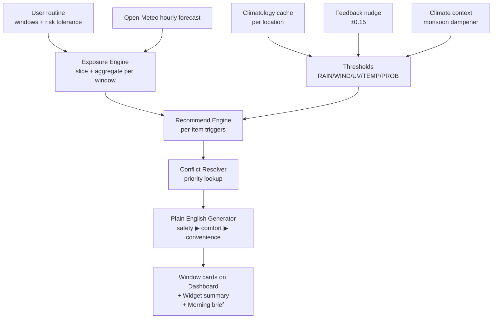
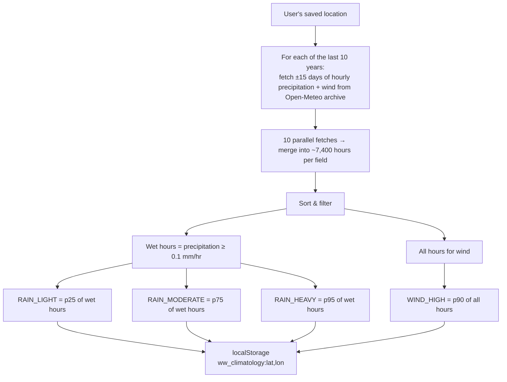
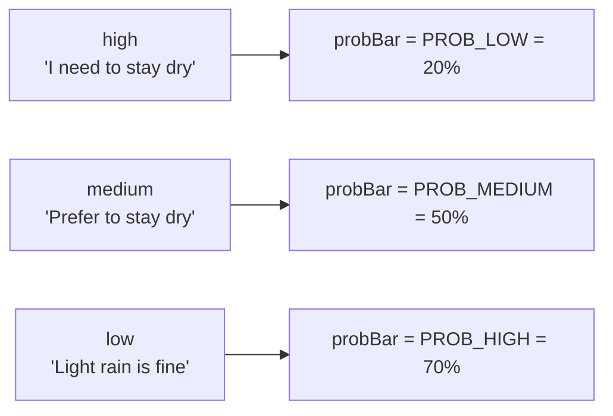
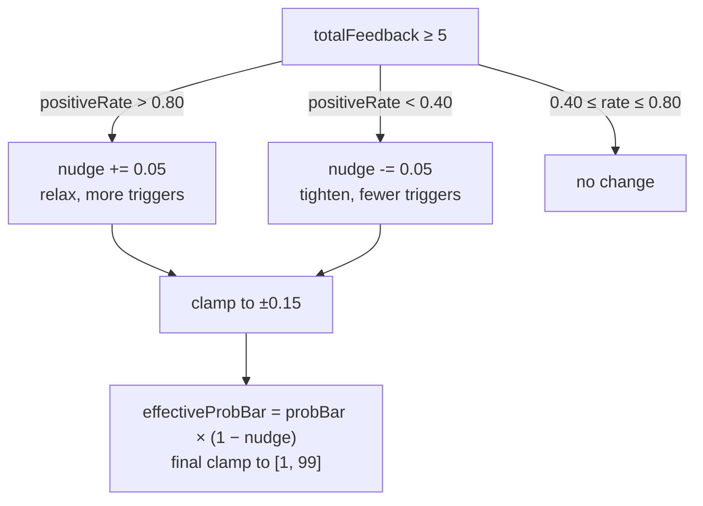
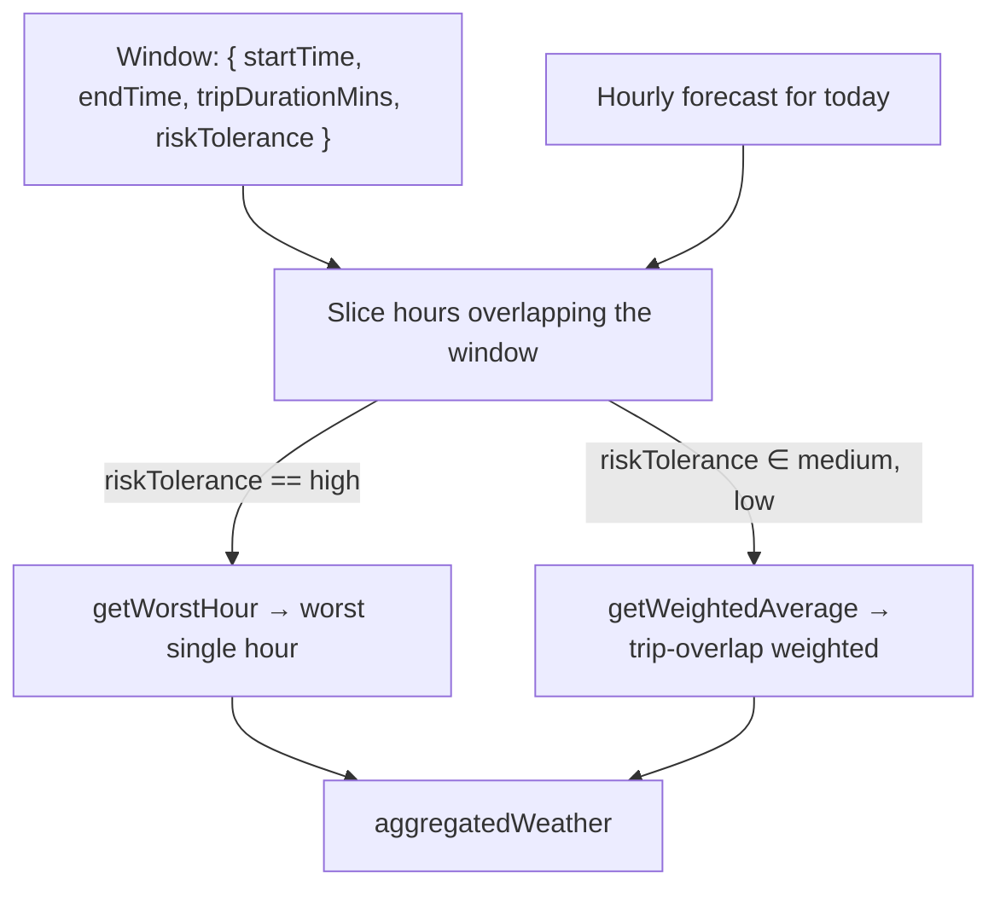
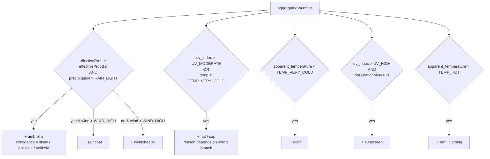
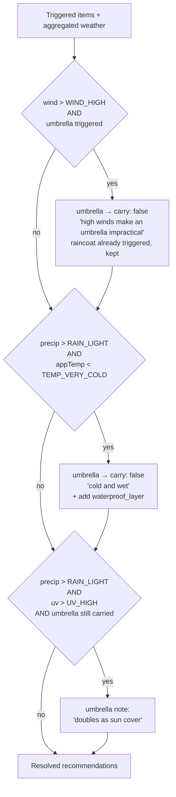

# WeatherWise Algorithm — Flow Reference

A precise map of every threshold, every trigger, and every conflict rule that turns hourly weather into your recommendations. Use this as the source of truth when refining the algorithm.

Where this differs from the brief in `ALGORITHM.md`, the code reflects the version below.

---

## 1. End-to-end pipeline



Per-window inputs feed the engine; per-window cards come out the other end. The same pipeline runs once per routine window, independently.

---

## 2. Where every threshold comes from

There are 13 thresholds in `src/core/thresholds.js`. Some are absolute (human physiology), some are climatology-derived (regional norms), one is per-user (risk tolerance), and one shifts over time (feedback nudge).

### 2a. Static thresholds — absolute

These never change. They map to human physiology and the WHO UV scale, not local climate.

| Threshold | Value | Used by |
|---|---|---|
| `UV_MODERATE` | `5` | hat trigger |
| `UV_HIGH` | `7` | sunscreen trigger |
| `TEMP_VERY_COLD` | `8 °C` | scarf, hat (cold path) |
| `TEMP_COLD` | `16 °C` | (band boundary, not a direct trigger) |
| `TEMP_HOT` | `30 °C` | light clothing trigger |
| `TEMP_VERY_HOT` | `37 °C` | reserved for future "stay indoors" tier |
| `TEMP_BURN` | `42 °C` | reserved for burn-risk warning |
| `PROB_LOW` | `20 %` | "I need to stay dry" trigger bar |
| `PROB_MEDIUM` | `50 %` | "Prefer to stay dry" trigger bar |
| `PROB_HIGH` | `70 %` | "Light rain is fine" trigger bar |

### 2b. Climatology-derived thresholds — `RAIN_*` and `WIND_HIGH`

These calibrate to *what's normal for this location at this time of year*. Computed once per location, cached for 7 days, recomputed in the background.



**Why ±15 days × 10 years (not a flat year):** the seasonal window calibrates to *this* season. Mumbai-June percentiles reflect monsoon conditions; Mumbai-February percentiles would be totally different. Without the seasonal window we'd average wet and dry seasons into a meaningless hybrid.

**Why p25/p75/p95 over *wet* hours:** if we included dry hours (most of the year is 0 mm/hr), every rain percentile collapses to zero and `precipitation > RAIN_LIGHT` always fires. Wet-hour percentiles describe "how heavy is the rain when it rains."

**Why p90 wind, not p60:** the original spec used p60, but p60 = "the typical 40th percent windiest hour" which by definition is normal. p90 = "windier than 90% of normal hours" — actually disruptive.

**Defaults when cache is missing:** `RAIN_LIGHT 0.5`, `RAIN_MODERATE 2`, `RAIN_HEAVY 8`, `WIND_HIGH 30` (km/h). Used until first background fetch completes.

### 2c. Risk-tolerance → probability bar (per window)

Each window stores a `riskTolerance` of `'high' | 'medium' | 'low'`. This selects which probability threshold is used to trigger rain recommendations for that window.



### 2d. Feedback nudge — moves the probability bar over time

After 5+ thumbs-up/down responses, the recommendation engine adjusts the probability bar to match the user's actual hit rate.



Nudge is applied **only** to `PROB_*` thresholds. `RAIN_*`, `WIND_HIGH`, `UV_*`, `TEMP_*` are never moved by feedback.

### 2e. Climate context — monsoon dampener

Probability gets one more pre-trigger modifier based on lat/lon and month:

| Region | Months | sensitivityMultiplier |
|---|---|---|
| Tropical / Monsoon (lat 0–25, N hemisphere) | Jun–Sep | 0.7 |
| Tropical / Monsoon (lat 0–25, S hemisphere) | Dec–Mar | 0.7 |
| Everything else | always | 1.0 |

```
effectiveProb = rawProb × sensitivityMultiplier
```

So a 60% rain forecast in Mumbai in July is treated as 42%, raising the bar so we don't shout "umbrella!" every day of the rainy season.

---

## 3. Per-window pipeline (Exposure Engine)

For each window in the routine, after deviation overrides:



**Worst hour (cautious users):** the single hour with the heaviest precipitation in the window. Ties broken by higher probability, then higher wind. Worst-case is the right call when you can't afford to be wrong.

**Weighted average (medium/relaxed):** each hour weighted by the number of trip-minutes that actually fall inside it. A 20-min trip centred in a 2-hr window equally weights both hours; an off-centre trip biases the closer hour. Falls back to equal weights if `tripDurationMins` is missing.

---

## 4. Recommendation Engine — per-item triggers

The engine reads `aggregatedWeather` + the four threshold groups and emits an item per matching rule. All triggers run in this order; multiple can fire for one window.



### Confidence labels (umbrella only)

| Rule | Result |
|---|---|
| `prob > 60% AND precip ≥ RAIN_MODERATE` | **likely** |
| `30% ≤ prob ≤ 60%` | **possible** |
| `prob < 30%` | **unlikely** |
| else | possible |

Other items always emit `confidence: 'likely'` since they're not probabilistic (temp/wind/UV are observed values, not chances).

---

## 5. Conflict Resolver

Conflicts apply *after* triggers, in priority order. Each rule may suppress items (mark `carry: false` with a reason) or add new ones. Suppressed items stay in the output so the UI can explain *why*.



Rules 1 and 2 are *suppressive* — both can fire for a given window. Rule 3 is *annotative* and only applies if umbrella is still carried.

---

## 6. Plain English output

Active recommendations (`carry: true`) are sorted by priority and capped at 3 sentences per window.

**Priority order:**

```
raincoat ▶ waterproof_layer ▶ umbrella ▶ scarf ▶ windcheater ▶ sunscreen ▶ hat ▶ light_clothing
```

**Template selection (excerpts from `src/core/plainEnglish.js`):**

| Item + confidence | Sentence |
|---|---|
| raincoat | "Rain with high winds during your {label} — an umbrella won't help. Take a raincoat." |
| waterproof_layer | "Cold and wet during your {label}. A waterproof layer is more useful than an umbrella." |
| umbrella + likely | "Very likely to rain during your {label}. Carry an umbrella." |
| umbrella + possible | "Chance of rain during your {label}. Worth bringing an umbrella." |
| umbrella + unlikely | "Slight chance of rain during your {label} — probably fine without one." |
| windcheater | "Strong winds during your {label}. A windcheater would help." |
| scarf | "It'll feel cold during your {label}. A scarf and warm layers advised." |
| hat | "Hat or cap recommended for your {label}." |
| sunscreen | "Apply sunscreen before your {label} — UV is high." |
| light_clothing | "Hot during your {label}. Dress light, drink water." |
| all clear | "Looking clear for your {label}. Nothing extra needed." |

---

## 7. Where each input comes from

| Input | Source | Refresh cadence |
|---|---|---|
| `routine.windows` | localStorage `ww_routine`, written by onboarding + RoutineEditor | On user edit |
| `routine.location` | localStorage, written by onboarding + LocationPicker | On user edit |
| `aggregated weather` | Open-Meteo `/v1/forecast`, cached 2h in localStorage `ww_weather_cache` | Every 2h (or refresh button) |
| `RAIN_* / WIND_HIGH` | Open-Meteo `/v1/archive`, cached 7d in `ww_climatology:lat,lon` | Every 7d, background |
| `thresholdNudge` | localStorage `ww_feedback`, accumulated from thumbs up/down | After every feedback past n=5 |
| `sensitivityMultiplier` | Computed from lat + current month | Every call (cheap) |
| `now / today` | System clock | Every render |

---

## 8. Known sources of imprecision

1. **Hourly granularity** — sub-hourly downpours aren't captured.
2. **Grid-based forecast** — Open-Meteo cells are 1–10 km. Microclimates lost.
3. **Shelter unknown** — algorithm doesn't know if your route is covered.
4. **Transport mode is stored but unused** — cycling vs walking changes exposure; we treat them identically for now.
5. **Climatology cache may be defaults** for the first session in a new location (background fetch hasn't completed). Tomorrow's recommendations will use the location-tuned values.
6. **Notifications fire only while a tab is open** at the configured time. Closed-tab delivery would need Web Push + a server.
